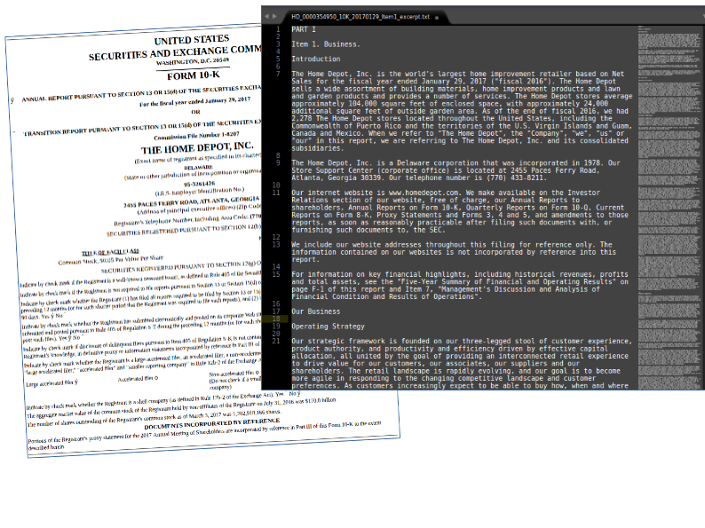

# SEC EDGAR Text
The goal of this project is to download large numbers of company filings
from the SEC EDGAR service, extract key text sections of interest,
and store them in an easily accessible and readable format.

Download key text sections of SEC EDGAR company filings. Format, organise
and store the text excerpts ready for both automated processing (NLP) and
for human reading (spot-checking). Structured storage of text and
metadata, with logging of failed document analyses. Suitable for
automation of large-scale downloads, with flexibility to customise
which sections of the documents are extracted. Compatible with all
main EDGAR document formats from 1993 onwards, and easily adapted or
extended to extract different sections of interest in EDGAR filings.

Generally accurate in extracting text, but lots of room for improvement.
Comments and contributions welcome!

#### About the project

* I completed this project during a sabbatical from my job.
* I used [SEC-Edgar-Crawler](https://github.com/rahulrrixe/sec-edgar)
for initial ideas which helped this project.
* Thanks to my colleagues at Rosenberg Equities for help with an earlier
attempt to download EDGAR data.

## Installation
Clone the repo, and install the packages in requirements.txt.

    git clone https://github.com/alions7000/SEC-EDGAR-text
    pip install -r SEC-EDGAR-text/requirements.txt

## Usage
*Basic usage* This will download those 500 large US companies in the
included 'companies_list.txt' file. Run from the project folder,
and accept the default settings when prompted.

    python SEC-EDGAR-text

*Typical usage* There are several arguments available to choose which
companies download list ot use, which types of filings to download, where to
save the extracted documents, multiprocessing option, download rate
and so on. For example:

    python SEC-EDGAR-text --storage=/path/to/my_storage_location --start=20150101 --end=99991231 --filings=10-K --multiprocessing_cores=8

See module utils.py to see a full list of command line options.

To download of a full history of key sections from 10-K and 10-Q filings
for (most) US companies takes less than 40GB storage: around 1 million
text excerpt files, plus a similar number of metadata files.

## Background
### About EDGAR

*History and future of EDGAR, links to key SEC procedures documents etc.*
Electronic filing was mandatory from 1996.

### Retrieving text data from EDGAR

### References
**Other packages**

Lots of open source projects have automated access to EDGAR filings.
A few access text data, like this one. Most focus on downloading whole
filing documents, financial statements information, or parsing
XBRL filings. This package aims to make access to large volumes of text
information easier and more consistent.

https://github.com/datasets/edgar A nice introduction to the EDGAR database
website.
https://github.com/eliangcs/pystock-crawler A project which also accesses
daily stock prices from Yahoo Finance

https://github.com/rahulrrixe/sec-edgar Download a list of filings and
save the complete document locally.
https://github.com/lukerosiak/pysec Django code for parsing XBRL documents.
https://github.com/eliangcs/pystock-crawler A project which also accesses
daily stock prices from Yahoo Finance

**Academic research**

Professor Bill McDonald, with collaborators including Prof Tim Loughran
has led much of the academic reserach into company filings' text
data in recent years. He much shares the approach
that he used for extracting EDGAR filings text data on his
[website](https://www3.nd.edu/~mcdonald/Word_Lists.html).
The approach to scraping the text data is somewhat different to that
used in this project, but it has a similar goal, and the documentation
gives a great introduction to the structure of the HTML filing documents.
The website includes links to related research, and
plenty of guidance on doing downstream research on EDGAR text documents.